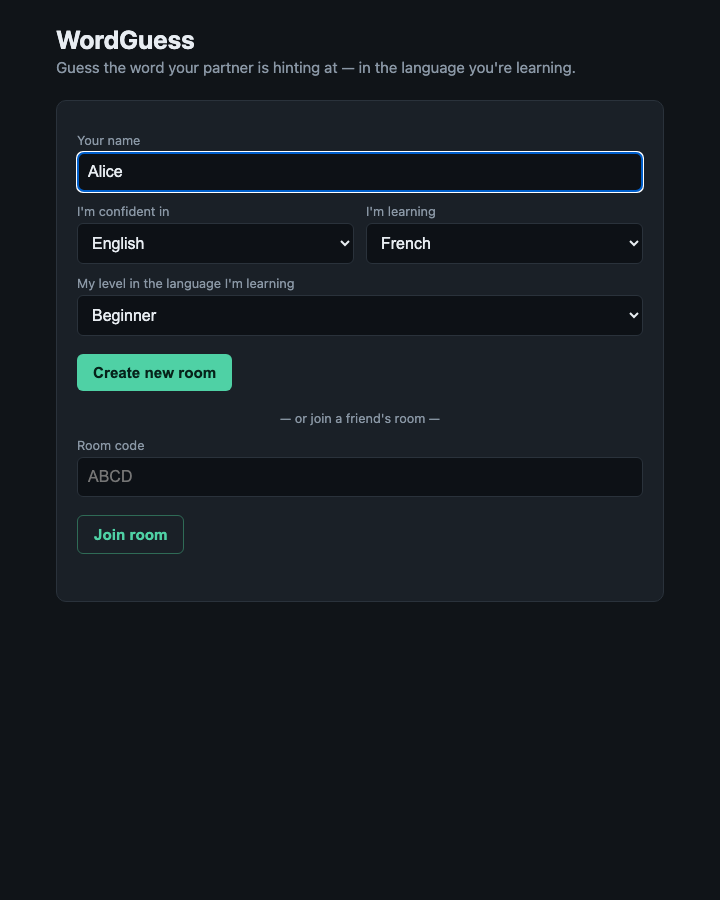
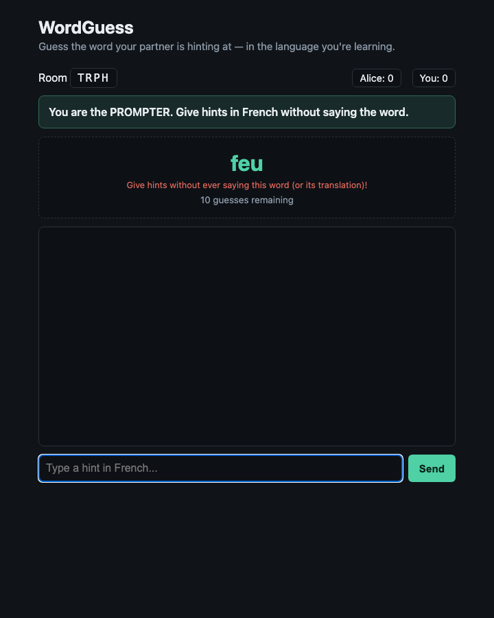
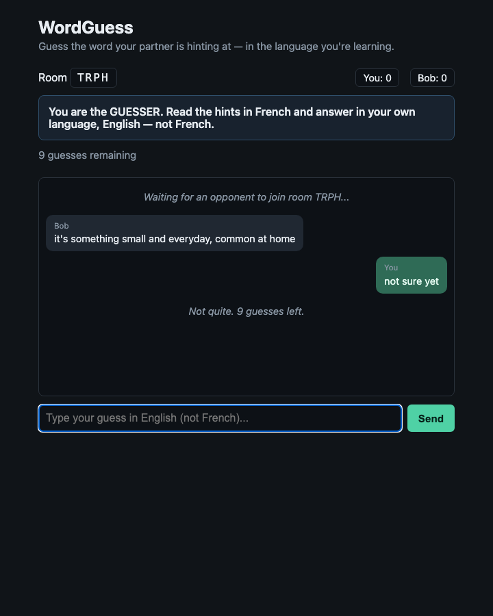
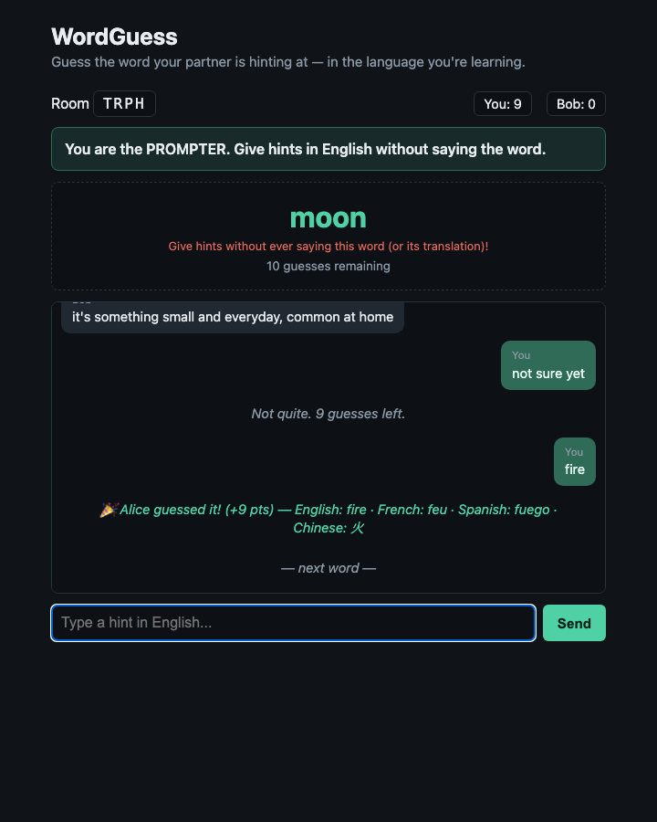

# wordguess.app

A real-time, two-player language-learning guessing game. One player (the
**prompter**) sees a secret word and gives hints/synonyms *in that word's
language* without ever using the word itself. The other player (the
**guesser**) reads the hints and answers *in their own native language*
(translation-style, testing comprehension rather than production). Guess
correctly within 10 tries to score points; fail all 10 and the word is
revealed. Either way, roles swap for the next word so both players get equal
turns learning.

|                                |                                  |
|--------------------------------|----------------------------------|
|  |  |
|  |  |

## Status

MVP in active development on branch `two-player-realtime-game`. Not yet
merged to `main`. See open PR for review status.

## How the game works

- Each **account/profile** has: a name, a `native_lang` (confident language),
  a `target_lang` (language they're learning), and a `level`
  (beginner / intermediate / advanced) in the target language.
- Two players join the same **room** (4-letter code). Room state is
  in-memory only — no database, no persistence across server restart. This
  is intentional for MVP scope.
- When both players are present, the server starts a round:
  - The **guesser** for round 1 is player 1 (join order). Their `target_lang`
    is the round's language.
  - The **prompter** is the other player. They're shown the secret word (in
    the round's target language) and must give hints/synonyms *in that
    language*, never using the secret word (or its translation into the
    guesser's native language — that would be an instant giveaway).
  - The **guesser** never sees the secret word. They read the prompter's
    hints and try to answer *in their own native language* — i.e., "what do
    you think this word means, in words you're fluent in?" This is a
    comprehension check, not a spelling/production check in the target
    language. (Answering with the target-language word itself doesn't
    count — the game will tell you to translate it instead.)
  - Guesses are lightly fuzzy-matched (Levenshtein distance ≤ 1, and only for
    answers ≥ 5 characters after normalization) so small typos don't cost a
    win.
  - Up to 10 guesses per word. Correct guess earns
    `[10,9,8,7,6,5,4,3,2,1][attempt_number - 1]` points (fewer attempts =
    more points). 10 failed guesses = 0 points and the word is revealed.
  - **After every round (win or lose), roles swap** — the guesser becomes
    the prompter and vice versa. This is what makes the game a mutual
    exchange: both players spend roughly equal time in "learning" mode.

## Running in Docker

```bash
docker compose -p wordguess-two-player up -d --build web
# app is on http://localhost:5050 — reachable from other machines on the
# same LAN via http://<host-machine-lan-ip>:5050 (find your LAN IP with
# `ipconfig getifaddr en0` on macOS)

# run the test suite inside the same environment used for the runtime image:
docker compose -p wordguess-two-player run --rm web python -m pytest tests/ -v

# spin down when done:
docker compose -p wordguess-two-player down
```

To play across two computers on the same local network: one player opens
`http://<host-lan-ip>:5050`, fills in their profile, and clicks "Create
room". They share the 4-letter room code (or the full `/room/<code>` URL)
with the second player, who opens the same base URL on their own machine,
fills in their own profile, and enters the code to join.

## Running locally (no Docker)

```bash
python3 -m venv .venv && source .venv/bin/activate
pip install -r requirements-dev.txt
python -m pytest tests/ -v          # unit + socketio integration tests
python app.py                       # serves on http://0.0.0.0:5050
```

## Architecture

- **Backend**: Flask + Flask-SocketIO (`async_mode="threading"`).
- **Game logic** (`game/`) is pure Python, framework-agnostic, and fully
  unit-tested without any Flask/socket involvement:
  - `game/wordbank.py` — loads `data/wordbank.json`, picks a word by level.
  - `game/engine.py` — `Player`, `Round`, `Room` — role assignment, hint
    taboo-checking, guess matching/scoring, role swapping.
  - `game/errors.py` — typed exceptions the socket layer maps to
    client-facing error/rejection events.
- **Realtime layer** (`app.py`) translates Socket.IO events into `Room`
  method calls and broadcasts results, sending **different payloads to each
  role** (the prompter's socket gets the secret word; the guesser's does
  not).
- **Frontend** (`templates/`, `static/`) is vanilla JS/CSS with a locally
  vendored `socket.io.min.js` (no CDN dependency — works on a LAN with no
  internet). No build step, no framework.
- **Word data** (`data/wordbank.json`) is a static, hand-curated list of ~44
  words across 3 levels with translations in `en`, `fr`, `es`, `zh`. No GPT
  calls, no external API — fully offline and deterministic.

### Data model

`data/wordbank.json`:
```json
{"words": [
  {"id": "apple", "level": "beginner",
   "translations": {"en": "apple", "fr": "pomme", "es": "manzana", "zh": "苹果"}}
]}
```

Player profile (submitted on room create/join):
```json
{"name": "Alice", "native_lang": "en", "target_lang": "fr", "level": "beginner"}
```

## Testing

- **Unit tests** (`tests/test_wordbank.py`, `tests/test_engine.py`) — pure
  game logic, no Flask/sockets.
- **Socket integration tests** (`tests/test_socket_integration.py`) — uses
  `flask_socketio.test_client` to simulate two connected clients through a
  full round.
- **Playwright end-to-end tests** (`tests_e2e/`) — two real browser contexts
  against a running instance, driving the actual UI as two humans would.

```bash
python -m pytest tests/ -v                                    # unit + socket
WORDGUESS_BASE_URL=http://localhost:5050 python -m pytest tests_e2e/ -v  # e2e, needs a running instance
```

## Known limitations (MVP scope, intentional)

- No accounts/persistence — profiles are re-entered each time you join a
  room; scores reset when the server restarts or the room empties.
- No language-detection validation on chat input — the UI labels which
  language to type in, but a player *could* type in the wrong language and
  the server won't catch it (taboo-word matching still works regardless).
- No matchmaking — players must share a room code manually.
- No reconnect/resume — if a player's browser refreshes mid-round, they
  rejoin as a new socket and the room treats them as absent.

## Origin / design history

The game began as a single-player prototype where a GPT model ("TabooGPT")
played the prompter role. That prototype (`apis/gpt.py`, now removed) made
live OpenAI API calls per turn, which made it slow, costly, and impossible
to unit test deterministically. The two-player rewrite replaces the AI
prompter with a second human player and a static, offline word bank — same
core gameplay loop, but real-time, free, testable, and actually fun with a
friend.

### Example single-player session (superseded)

```
TabooGPT: 🔴它是紅色的 (Tā shì hóngsè de)
Player: A fire truck?
TabooGPT: 這不是救火車. 🚒 可以吃 🍔 (Zhè jiùhuǒ chē. Kěyǐ chī)
Player: 是西紅柿嗎?
TabooGPT: 不是。味道很甜 Bù shì. Wèidào hěn tián.
Player: What does weidao mean?
TabooGPT: It refers to the taste 👅
Player: 一個貧國！
TabooGPT: 沒錯Méicuò 🎉
上一輪你學到了... Shàng yīlún nǐ xué dàole…
* 味道 Wèidào – taste
讓我們再玩一次 Ràng wǒmen zài wán yīcì
它非常鋒利 Tā fēicháng fēnglì
```
